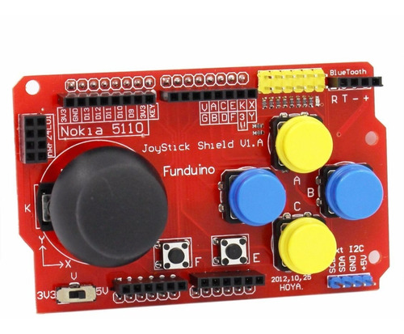

# Tetris Game

## Introdução

Bem-vindo ao jogo Tetris! Este é um jogo clássico onde o objetivo é completar linhas com peças que descem, eliminando-as e ganhando pontos. Veja o quão alto você pode chegar antes de atingir o topo da tela.

## Hardware Utilizado

Este jogo foi desenvolvido e testado usando uma placa Funduino equipada com botões e um joystick para proporcionar uma experiência de jogo interativa.

## Controles

- **A/B**: Mover a peça para a esquerda/direita.
- **C/Y**: Rotacionar a peça.
- **D/X**: Descer rapidamente a peça.
- **E/F**: Não são usados.
- **Joystick**: Controla a posição da peça.

## Compilação e Execução

1. Baixe o código do Tetris.
2. Abra-o na Arduino IDE.
3. Conecte seu Arduino ou ESP/NodeMCU ao computador.
4. Compile e carregue o código no dispositivo.
5. Use os controles mencionados acima para jogar.

## Observações

- Certifique-se de conectar os botões e o joystick conforme definido no código.
- O joystick controla a direção da peça.
- As peças descem automaticamente em intervalos regulares.
- Divirta-se e veja quão alto você pode chegar na pontuação!
